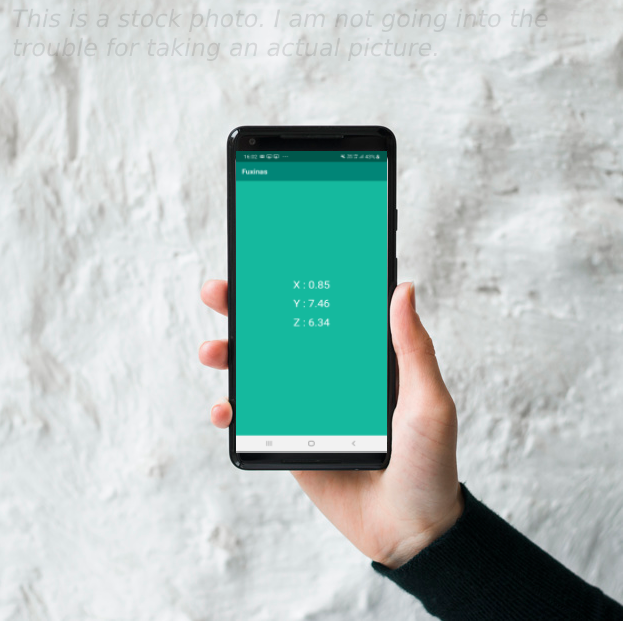

# fuxinas
i honestly have no Idea why did I needed to upload this on github, but 🤷‍♂️
___
this is an android app. apparently if you don't make an app in your life, you aren't a software engineer. Hope it is enough to call myself as an AnDroId DevElopEr

Anyways,

### Install: 
[Download and Allow all permissions](https://github.com/ayushbasak/fuxinas/releases/tag/v1.0) 
*This is an APK. It won't work on your Kali Linux Machine. It is not supposed to.*
Obviously, Google will try hard to prevent you from installing this app, but trust me I ain't no hacker. I was stuck trying to change the background color for two hours, I am not interested in your private information.

#### Warning: 
While using this app, your phone might slow down, it might heat up, your battery can explode, your parents can kick you out, or Trump can declare a nuclear war with North Korea (aka China) . I take no responsibility for any of that.

#### Current Version: 1.0
**7 Oct 2020**
*Compatible with Android 5.1 and above. No, like seriously, who th uses KitKat anyways* 
Although there's absolutely no possibility that there will be a next version.

#### Here's a screenshot:

Enjoy! 🤡
